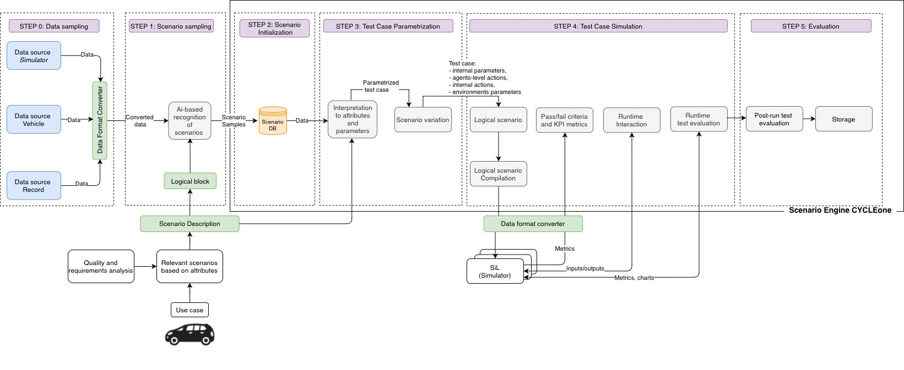

# CYCLEone 
CYCLEone is a Scenario Engine. It is an open-source, cross-platform tool for end-to-end validation and verification of autonomous driving solutions. We made it to be flexible, middleware and data source-agnostic for efficient development of robust autonomous driving systems.

# CYCLEone Blueprint


# Use Case
Ususally a software team has some production code to be tested; a simulation tool to emulate inputs to the code modules and to consume output(s); and some delivery/testing pipelines to execute tests periodically and automatically. CYCLEone is a simple-to-use scenario engine, that could effectively utilize all available computation power to execute test scenarios and check whether a module-under-test fullfills provided requirements.

# Features 
* Variaty of data sources
  Use ROS bags, Cyber records, real-scale data
* Independent of autonomous driving platform in use
* Flexibility
  Use your own metrics evaluation tool, scneraio test approach: SIL/HIL/Simulator, etc. 
* Standardized Interface
  Enable the consistent use of test cases and scenarios across different test instances and test environments throughout the development process and within homologation processes.
* Cross-platform
 Mac, Linux, Windows
* Open-source and extensible
  Contains basic scenarios that can be complimented by your own: basic scenarios -> scenario database -> edge case database 

# CYCLEOne Overview
## service notes

```
~/cycle_on/service$ cmake -S . -B build
~/cycle_on/service$ cmake --build build

~/cycle_on/service$ (cd build && ctest)
~/cycle_on/service$ ./build/src/service
```

## service integration

```
~/cycle_on/$ sudo bash docker/installers/install_essentials.sh
~/cycle_on/$ sudo bash docker/installers/install_boost.sh
```

## cli-tool notes
```
$ python3 -m pip install build
$ python3 -m pip install setuptools
$ python3 -m pip install --user virtualenv --force-reinstall

~/cycle_on/cli_tool$ python3 src/cycleon/cmd.py add --reuse_global_config
~/cycle_on/cli_tool$ python3 src/cycleon/cmd.py remove id
~/cycle_on/cli_tool$ python3 src/cycleon/cmd.py status id
~/cycle_on/cli_tool$ python3 src/cycleon/cmd.py result id

~/cycle_on/cli_tool$ python3 -m pytest test/
~/cycle_on/cli_tool$ python3 -m build
~/cycle_on/cli_tool$ python3 -m pip install dist/cycleon-0.0.1-py3-none-any.whl --force-reinstall
~/cycle_on/cli_tool$ cycleon
```

## docker notes
```
~/cycle_on$ rm -rf service/build cli_tool/dist cli_tool/src/cycleon.egg-info
~/cycle_on$ docker build -t cycleon/ci:0.1 .
~/cycle_on$ docker run --name cycleon_ci -it -v ${PWD}:/cycleon --rm cycleon/ci:0.1
~/cycle_on$ docker container exec -it cycleon_ci bash
```


# Installation 
TO DO

# Usage

TO DO


# Road map
TO DO

## Help wanted:
* Windows integration
* Cmake review
* Extension of scenarios data base

# License 

CYCLEone is licensed under the MIT License. 
